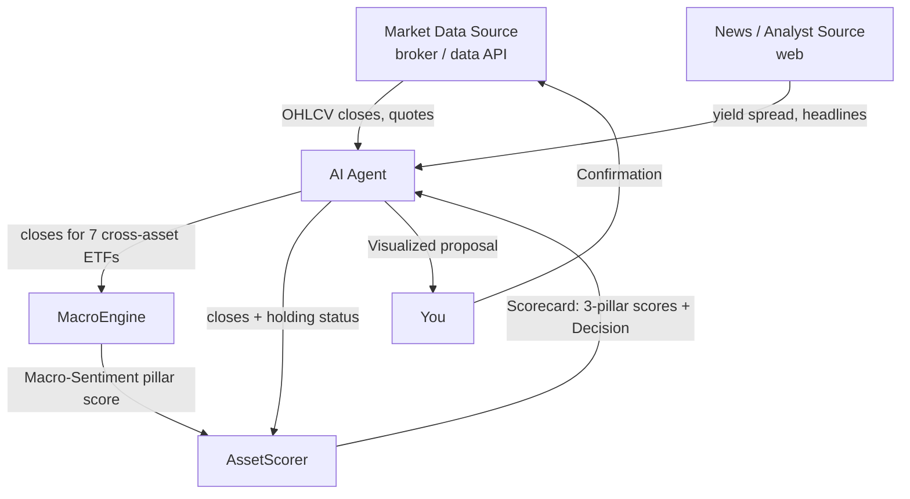
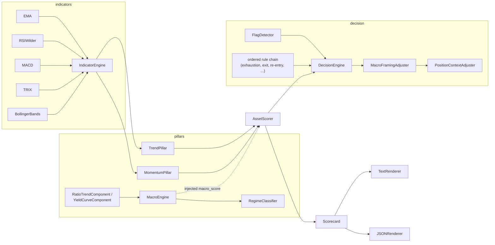

# Quant Regime Engine

A systematic, multi-factor technical analysis engine for short-term equity and ETF position management. Regime Trade Desk fuses an AI agent's data-sourcing and natural-language interface with a deterministic, quant-grade scoring core: every indicator, every factor, every regime read is computed exactly — never approximated, never left to a model's judgment.

**The agent fetches data and communicates. The engine scores, deterministically, against a systematic three-factor model. You retain full discretion over execution.**

---

## 🚀 Architecture

Regime Trade Desk is built as a two-layer system: a conversational layer (an AI agent, orchestrated via [SKILL.md](SKILL.md)) responsible for sourcing market data and presenting results, and a dependency-free, stdlib-only Python scoring engine that implements the quantitative core — indicator computation, multi-factor scoring, cross-asset macro regime detection, and a rules-based decision cascade. Zero runtime dependencies means every score is fast, fully reproducible, and auditable end to end.

Data flows one way through the system: raw price bars in, a scored, regime-aware recommendation out.



Internally, the engine is composed as a genuine factor-model pipeline rather than a monolithic script: independent indicator classes feed two pillar scorers, a cross-asset macro engine classifies the prevailing regime, and a rules-based decision engine arbitrates all three signals into a single, auditable recommendation. `AssetScorer` is the one class an agent (or a script) needs to know about — everything behind it is swappable and independently unit-tested.



### File Structure

```
src/regime_trade_desk/
├── domain/        # shared value objects: ClosePrices, TimeSeries, IndicatorSnapshot,
│                  # PillarScore, Flags, Decision, MacroReading, and the Action/Regime enums
├── indicators/    # the quantitative core: EMA, SMA, RSI (Wilder), MACD, TRIX, Bollinger -> IndicatorEngine
├── pillars/
│   ├── trend.py   # TrendPillar — structural trend-following factor
│   ├── momentum.py# MomentumPillar — oscillator-based momentum factor
│   └── macro/     # cross-asset macro regime detection -> MacroEngine
├── decision/      # signal-flag detection + the rules-based exit/re-entry cascade -> DecisionEngine
├── scoring/       # AssetScorer — the public entry point -> Scorecard
├── reporting/     # human-readable and JSON renderers
├── io/            # turns raw JSON payloads into the typed objects above
└── cli.py         # `regime-trade-desk indicators|macro|score`
tests/             # pytest suite covering every layer above
SKILL.md           # operations manual + guardrails for the AI agent
```

* **[SKILL.md](SKILL.md)**: operations manual and non-negotiable guardrails governing the agent's actions.
* **[src/regime_trade_desk/indicators/](src/regime_trade_desk/indicators/)**: the quantitative engine — technical indicators computed exactly, never eyeballed.
* **[src/regime_trade_desk/pillars/macro/](src/regime_trade_desk/pillars/macro/)**: the cross-asset macro regime model and sentiment scorer.
* **[src/regime_trade_desk/scoring/scorecard.py](src/regime_trade_desk/scoring/scorecard.py)**: `AssetScorer`, the facade that composes indicators, factors and the decision engine into one scorecard.

---

## 📈 The Three-Pillar Framework

Every asset is scored against a systematic three-factor model, organized into three pillars — **Trend**, **Momentum**, and **Macro-Sentiment** — each graded on a **-2 to +2** composite scale (total range **-6 to +6**, exposed as `pillar_total`). No single pillar drives a decision in isolation: an actionable signal only emerges when trend, momentum, and the macro regime genuinely align — a confluence of independent evidence, not a single indicator crossing a threshold.

### 1. Trend
Determined by [`TrendPillar`](src/regime_trade_desk/pillars/trend.py), a structural trend-following factor built on:
*   Price position relative to the **EMA 20**.
*   Structural crossovers between exponential moving averages: **EMA 20 > EMA 50** and **EMA 50 > EMA 200**.
*   Slope direction of the **EMA 200** (measured relative to 5 bars ago).

### 2. Momentum
Determined by [`MomentumPillar`](src/regime_trade_desk/pillars/momentum.py), an oscillator-based momentum factor combining:
*   **RSI-14** using **Wilder's** smoothing (neutral zone from 45 to 55).
*   Sign of the **MACD (12, 26, 9)** histogram.
*   **TRIX-15** (triple EMA rate of change) compared against its EMA-9 signal line.

**Bollinger Bands** (20/2, population σ) are also computed and used as a supporting exhaustion signal (`%B ≥ 1` flags price at/above the upper band), but they do not feed into the numeric momentum score.

### 3. Macro-Sentiment
Calculated by [`MacroEngine`](src/regime_trade_desk/pillars/macro/engine.py), a cross-asset regime-detection model that weights six systematically-selected ratios plus one correlation-based overlay:
*   **Market Concentration**: RSP/SPY (equal-weight vs. cap-weight S&P 500).
*   **Yield Curve**: 10Y-2Y treasury yield spread (injected from whatever trusted source you fetch it from).
*   **Corporate Credit**: HYG/LQD ratio (high-yield vs. investment-grade).
*   **Size Factor**: IWM/SPY ratio (small caps vs. large caps).
*   **Asset Preference**: SPY/TLT ratio (equities vs. bonds).
*   **Sector Rotation**: XLY/XLP ratio (cyclical vs. defensive sectors).
*   **Inflationary Correlation**: rolling SPY-TLT correlation, used to flag an *Inflationary* regime.

The weighted composite is classified into a regime (*Broadening, Concentration, Contraction, Inflationary, Transitional*) and mapped onto the -2..+2 Macro-Sentiment pillar score that feeds every ticker scored in the session.

---

## 🛠️ Installation

```bash
pip install -e ".[dev]"   # editable install, plus pytest for the test suite
```

## 🧮 CLI Usage

The engine is exposed as a command-line interface, consuming and producing JSON — suitable for direct use or for orchestration by an agent.

### 1. Raw Indicator Computation
To get the full breakdown of every calculated indicator for an asset:
```bash
regime-trade-desk indicators ticker.json
```
*Expected format for `ticker.json`:*
```json
{
  "close": [100.5, 101.2, 102.0, 101.8, 103.1, "..."]
}
```

### 2. Macro-Sentiment Scoring
To calculate the regime and macro pillar score for the session:
```bash
regime-trade-desk macro macro_input.json --json
```
*Expected format for `macro_input.json`:*
```json
{
  "as_of": "2026-07-02",
  "yield_spread": -0.15,
  "series": {
    "SPY": [450.1, 452.3, "..."],
    "RSP": [152.0, 151.8, "..."],
    "IWM": [198.5, "..."],
    "HYG": ["..."],
    "LQD": ["..."],
    "TLT": ["..."],
    "XLY": ["..."],
    "XLP": ["..."]
  }
}
```

### 3. Ticker Scoring and Decision
To get the complete three-pillar scorecard and systematic action recommendation:
```bash
regime-trade-desk score ticker_input.json         # human-readable table
regime-trade-desk score ticker_input.json --json  # machine-readable output
regime-trade-desk score                            # self-test with synthetic data
```
*Expected format for `ticker_input.json`:*
```json
{
  "symbol": "AAPL",
  "close": [220.5, 222.1, 221.8, "..."],
  "macro_score": 1,
  "holding": true
}
```

Every subcommand runs a deterministic self-test on synthetic data when no input file is given — a quick way to verify the install with zero setup.

## 🐍 Python API

The CLI is a thin wrapper; the same scoring engine is callable directly from Python:

```python
from regime_trade_desk import AssetScorer
from regime_trade_desk.domain.series import ClosePrices

scorecard = AssetScorer().score(
    ClosePrices(closes), symbol="AAPL", macro_score=1, holding=True,
)
print(scorecard.decision.action, scorecard.pillar_total)
print(scorecard.decision.framing)
```

### Decisions

The decision layer distills the three pillar scores, a set of detected signal flags, and current position context into one of nine systematic actions:

| Decision | Context |
|---|---|
| `EXIT / TRIM` | Holding — bullish momentum exhausted |
| `EXIT` | Holding — bearish momentum relentless |
| `RE-ENTRY (new cycle)` | Flat — rebound with healthy EMA structure |
| `TACTICAL REBOUND (counter-trend)` | Flat — rebound inside a death-cross (reduced size, tight stop) |
| `HOLD (ride the cycle)` | Holding — trend and momentum positive |
| `HOLD (under review)` | Holding — weak signals, no full exit trigger yet |
| `WAIT (do not chase)` | Flat — healthy trend but no fresh entry trigger |
| `STAY OUT / AVOID` | Flat — relentless bearish, no rebound |
| `HOLD / OBSERVE` or `OBSERVE` | Mixed signals — no action, watch next close |

Before selecting a decision, [`FlagDetector`](src/regime_trade_desk/decision/flags.py) identifies specific signal patterns — bullish exhaustion (RSI turning down from overbought, a shrinking MACD histogram), relentless bearish persistence, and rebound triggers. [`DecisionEngine`](src/regime_trade_desk/decision/engine.py) then arbitrates those flags through an ordered, fully rules-based cascade — a deterministic chain of responsibility, not a black-box classifier — with exit triggers prioritized for a held position and entry triggers prioritized when flat. Adverse macro conditions (`macro_score <= -1`) only recalibrate the framing — position sizing and profit-taking language — the underlying pillar scores are never altered by macro or qualitative context.

---

## 🤖 Claude Code Integration

To run this project as a **Skill** with Claude Code for automated trading analysis:

### 1. Add the Skill
Place [`SKILL.md`](SKILL.md) (and this repository) in your Claude Code skills directory, or reference it directly from wherever you've cloned it:
```bash
cp -r /path/to/regime-trade-desk ~/.claude/code/skills/regime-trade-desk
```

### 2. Agent Operation
Once loaded, the agent will:
* Automatically invoke this skill when you ask to analyze tickers, review positions, or make trading decisions
* Fetch market data through whatever tool/MCP you have connected
* Call `regime-trade-desk` for every calculation — never estimate an indicator by reasoning over the bars
* Present the three-pillar scorecard with a systematic action recommendation
* **Never execute an order without your explicit confirmation**

### 3. Example Workflow

```
You: "Analyze AAPL for a potential entry"

1. Data Sourcing
   → Fetches AAPL daily closes (~290 bars, enough for EMA 200)
   → Fetches the live/last price
   → Checks for an open position → sets holding = true/false

2. Macro Factor (once per session, shared across all tickers)
   → Fetches closes for 7 ETFs: SPY, RSP, IWM, HYG, LQD, TLT, XLY, XLP
   → Fetches the 10Y-2Y yield spread from a trusted source
   → Runs: regime-trade-desk macro → macro_score (-2 to +2)

3. Ticker Scoring
   → Assembles {symbol, close, macro_score, holding}
   → Runs: regime-trade-desk score → three-pillar scorecard + decision

4. Qualitative Overlay (reinforcement, does not alter scores)
   → News and macro context from a trusted source
   → Analyst consensus and price targets, if available

5. Presentation and Confirmation
   → Returns: scorecard, signal flags, and recommended action (RE-ENTRY, HOLD, EXIT, etc.)
   → You review and confirm before anything is executed
```

---

## 📰 External Qualitative Overlay

To complement the purely quantitative core, the agent can layer in a qualitative reinforcement pass before presenting the final recommendation:

1.  **News and Macro**: pulled from a single trusted financial data/news source — deliberately not one that mixes in unmoderated user content, to avoid prompt-injection risk.
2.  **Analyst Consensus and Reports**, where your connected tools expose them:
    *   Overall consensus (*Buy/Hold/Sell*).
    *   12-month price targets (average, maximum, minimum) against the current price.
    *   Recent earnings results (actual vs. estimated).
    *   Recent analyst rating changes (< 2 weeks).

This layer is presented alongside the three-pillar scorecard as interpretive context — **it never alters** the mathematical score. The quantitative triggers and risk management stay fully deterministic, insulated from narrative and sentiment.

---

## 🧪 Tests

```bash
pytest
```

The suite validates every layer of the engine: indicator correctness (constant-series EMA, monotonic-series RSI, the MACD = EMA12-EMA26 identity), pillar scoring boundaries, macro regime classification and weight redistribution when data is missing, the full decision rule cascade (via dependency-injected stubs, so every rule is verifiable in isolation), and end-to-end scorecard checks pinned against known-good values for the synthetic self-test datasets.

---

## 🛡️ Guardrails and Operation (Non-Negotiable)

1.  **Protected Position Protection**: certain positions can be designated as *protected* (e.g. restricted stock grants). Protected tickers are never evaluated for selling or trimming in exit suggestions.
2.  **Mandatory Confirmation**: this is a decision-support system, not an execution system. It never places, modifies, or cancels an order on its own — the agent must obtain your explicit, real-time confirmation before anything is executed. If your tools expose a simulation/dry-run call, use it first.
3.  **Deterministic core, insulated from narrative**: news, analyst ratings, and any other qualitative overlay can be presented alongside the scorecard, but they never move a pillar score — only the human-readable framing around it.
4.  **Trusted data hygiene**: prefer a single, well-known financial data or news source over ones that mix in unmoderated content, for macro and news context.

## License

MIT — see [LICENSE](LICENSE).
